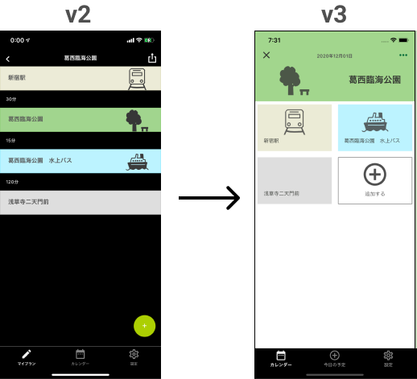

<!--
class: title
-->


# React Native + Firestoreで運用しているアプリをRESTful APIからGraphQLに移行した話


2020/12/17
@wheatandcat

---


## 自己紹介

<!--
class: content
-->


 - wheatandcat
 - フリーランスのエンジニア
 - React Native / Go / Nuxt.js / Firebase 周りが得意です


---

# ペペロミアについて


React Native(Expo)で作成しているライフログアプリです。

Apple Store / Google Play Storeで配信中 
& 全コードGitHubで公開中

---

<!--
class: force
-->

# 今回やったこと!
---

アプリのv2からv3へバージョンアップで、
API実装を**RESTful API**から**GraphQL**に完全移行しました。

---

# v2の構成

<!--
class: content
-->

|  項目  |  ログイン前  |  ログイン後  |
| ---- | ---- | ---- |
|  書き込み  |  SQLite  |  RESTful APIでサーバーを経由してFirestoreに書き込む  |
|  読み込み  |  SQLite  |  clientから直接Firestoreを読み込む  |

 - APIドキュメント: Swagger

---

# v2構成での問題点

<!--
class: thin
-->

 - ログイン前のSQLiteのDB構成を、**そのままFirestoreのデータ構成**にしていたのでFirestoreのメリットが活かなかった
 - clientから直接Firestoreを読み込む処理を宣言する関係でアプリのコードが多くなり、複雑になった
 - RESTful APIやFirestoreに関するTypeをフロントエンド、バックエンドの**プロジェクト毎にTypeを管理するのが辛い**
 - Firestoreの**security rulesが複雑**
 - Swaggerの更新を忘れて**実装と乖離する**

---

# Firestoreの特徴

<!--
class: content
-->

 - データモデルは**階層型データ構造**
 - RDBのJOINは存在しない
 - where-inやarray-contains-anyは、**双方10件までしか取得できない制約がある**

<br />

### 結論:

上記の性質からRDBと同じ設計思想で進めると、どこかしらで躓く
という事でv3で、どう改善したかという話が次になります。

---

# v3の構成

|  項目  |  ログイン前  |  ログイン後  |
| ---- | ---- | ---- |
|  書き込み  |  SQLite  |  GraphQLを経由してFirestoreに書き込む  |
|  読み込み  |  SQLite  |  GraphQLを経由してFirestoreを読み込む  |


---

# v3での改善点①
<!--
class: thin
-->

```
ログイン前のSQLiteのDB構成を、そのままFirestoreのデータ構成にしていたので
Firestoreのメリットが活かなかった 
```
 - データ構成を**Firestoreの活かせる作りに変更**した

```
clientから直接Firestoreを読み込む処理を宣言する関係でアプリのコードが多くなり、複雑になった
```

 - Firestoreのアクセスコードが**全てbackend側になったのでアプリ側の実装がシンプルになった**

---

# v3での改善点②

```
RESTful APIやFirestoreに関するTypeをフロントエンド、バックエンドのプロジェクト毎にTypeを管理するのが辛い
```
 - **graphql-codegen**を使用することでtypeは全て自動生成できるようになった

```
Firestoreのsecurity rulesが複雑
```
 - Firestoreのアクセスが全てサーバー側になったため考慮する必要がなくなった

```
Swaggerの更新を忘れて実装と乖離する
```
 - APIドキュメントは、GraphQLから自動生成できるので実装と乖離はしなくなった

---

# 逆にv3の構成で失ったもの

 - Firestoreのアクセス全てサーバー側で実装したため**リアルタイムアップデートの機能は失った**
 
※一応GraphQLの**Subscriptions**を実装すれば、リアルタイムアップデートの実装も可能だがコストと見合わないため今回は見送っています

---

# データ構成の比較

### v2でのFirestoreのデータ構成

<!--
class: content
-->

```
├──users/:id
├──calendars/:id
├──items/:id
├──itemDetails/:id
└──expoPushTokens/:id
```

### v3でのFirestoreのデータ構成

```
version/1
    └── users/:id
             ├── expoPushTokens/:id 
             └── calendars/:date 
                           └──items/:id
                                  └──itemDetails/:id

```

---

# v3でのFirestoreのデータ構成のメリット

 - user_idのみでユーザーの全情報を取得できる
 - user_idと日付でcalendarの情報が取得できる
 - calendarのDocumentIDが日付なので、必ずユニークの構造になる
 - where-inやarray-contains-anyを使わずに書くデータを取得できる

 <br />

```
version/1
    └── users/:id
             ├── expoPushTokens/:id 
             └── calendars/:date 
                           └──items/:id
                                  └──itemDetails/:id

```

---

<!--
class: force
-->

# 各画面とデータの読み込み


---

<!--
class: content
-->

# カレンダー画面


カレンダーに表示する分のデータが必要なので以下のようなクエリで取得

```
f.Collection("version/1/users/1/calendars").Where("date", ">=", "2020-12-01T00:00:00")
.Where("date", "<=", "2020-12-31T31:59:59")
```

---

# ライフログ画面


1日に表示する分のデータが必要なので以下のようなクエリで取得

```
f.Collection("version/1/users/1/calendars/2020-12-01")
```

---

# ライフログ詳細画面


ここではidだけデータを取得したいので**CollectionGroup**を使用して取得

```
 f.CollectionGroup("itemDetails").Where("id", "==", "efjhij")
```

---

# CollectionGroupとは？

Firestoreのデータ構造上、親階層のDocuementIDの情報を持っていない限り、
子階層へのアクセスはできませんが、**CollectionGroup**を使用することで、横断的にアクセスすることができます。

### 通常のitemDetailのアクセス
```
f.Collection("version/1/users/1/calendars/2020-12-01/items/abcded/itemDetails")
.Where("id", "==", "efjhij")
```

### CollectionGroupを使用したアクセス
```
f.CollectionGroup("itemDetails").Where("id", "==", "efjhij")
```
---

# CollectionGroupの注意点

 - **DocuementID**が重複する可能性がある
 - コレクションIDが一致すればデータ構造関係無しにデータを取得してしまう
   - 別階層に同名のコレクションIDが存在する場合でもデータは取得できる
 - whereは単一かつ範囲系の条件は指定できない

---

# データ構造変更によるマイグレーション

もちろん、構造の変更するには実際のデータマイグレーションが必要なので、以下でマイグレーションスクリプトを作成

https://github.com/wheatandcat/PeperomiaTool/tree/master/FirestoreMigration

<br />

詳しくは以下、参照
[記事: Firestoreを新設計にマイグレーションする](https://www.wheatandcat.me/entry/2020/10/04/220607)

---
<!--
class: force
-->

# バックエンドの実装


---

<!--
class: content
-->


# GraphQLの実装

GraphQLは**gqlgen**を使用して実装

### gqlgenとは

https://github.com/99designs/gqlgen

GraphQLのスキーマファイルからGraphQLのコードを自動生成機能を持つフレームワークです。

---

### gqlgenの自動生成

こんな感じでスキーマファイルからコードが自動生成されます。


---

# 作成したGraphQL一覧


https://github.com/wheatandcat/PeperomiaBackend/blob/master/schema.md

---

<!--
class: force
-->

# アプリの実装


---

<!--
class: content
-->

# アプリのGraphQLの繋ぎ込み

 - GraphQLの繋ぎ込みは**graphql-codegen**を使用して実装

 ### graphql-codegenとは？

  - graphql-codegenを使用することで**GraphQLのスキーマファイル**と**gqlファイル**から、**Types**や**Custom Hooksでのアクセス**のコードを自動生成することができます。

---

# graphql-codegenでQuery(読み込み)の自動生成

gqlファイルを元に、以下のコードが自動生成されます。


---

# 自動生成されたコードを使用してデータを取得する


自動生成されたuseCalendarQueryに引数を渡すことでgraphqlのデータを取得できます。

```
import React ,{ memo } from 'react';
import { useCalendarQuery } from 'queries/api/index';


const Connected: React.FC<Props> = memo((props) => {

  const { data, loading, error } = useCalendarQuery({
    variables: {
      date: props.date,
    },
    fetchPolicy: 'network-only',
  });

```

---

# graphql-codegenでMutation(書き込み)の自動生成

gqlファイルを元に、以下のコードが自動生成されます。


---

# 自動生成されたコードを使用してデータを更新する


自動生成されたuseCreateCalendarを使用してデータを更新する。

```
import React ,{ memo, useCallback } from 'react';
import { useCreateCalendarMutation, NewItem } from 'queries/api/index';

const Connected: React.FC<Props> = memo((props) => {
  const [ createCalendarMutation ] = useCreateCalendarMutation({
     onCompleted({ createCalendar }) {

      props.navigation.navigate('Calendar', {
        date: dayjs(createCalendar.date).format('YYYY-MM-DDT00:00:00'),
      });
    },
    onError(err) {
      Alert.alert('作成に失敗しました', err.message);
    },
  });

  const onSave = useCallback(
    (item: NewItem) => {
      const variables = {
        calendar: {
          date: props.date,
          item,
        },
      };

      createCalendarMutation({ variables });
    },
    [createCalendarMutation, props.date]
  );
```

---

# SQLiteとGraphQLの切り替え

ログイン前は**SQLite**、ログイン後は**GraphQL（Firestore）** でデータ管理しているので、
その部分を**Custom Hooks**を使用して実装


```
import { useAuth } from 'containers/Auth';
import { CalendarQueryHookResult, useCalendarQuery, CalendarQueryVariables } from 'queries/api/index';
import { WatchQueryFetchPolicy } from '@apollo/client';
import useCalendarDB from 'hooks/db/useCalendarDB';
import { isLogin } from 'lib/auth';

const useCalendar = (props: Props) => {
  const { uid } = useAuth();
  let useHooks: UseHooks;

  if (isLogin(uid)) {
    // ログイン時は自動生成されたHooksを使用
    useHooks = useCalendarQuery;
  } else {
    // ログイン前は上記と同じインターフェースで自作したSQLiteアクセス用のCustom Hooksを使用
    useHooks = useCalendarDB
  }

  return useHooks(props);
};

export default useCalendar;
```

---

<!--
class: force
-->

# データ設計に合わせてデザインを変更

---

<!--
class: content
-->

# データ設計からの画面設計

今回のデータ設計の変更によりライフログは全てカレンダーに紐づくようになったので、
諸々画面設計の見直しをしました。


### v3でのデータ設計
```
version/1
    └── users/:id
             ├── expoPushTokens/:id 
             └── calendars/:date 
                           └──items/:id
                                  └──itemDetails/:id

```

---

# ホーム画面

<!--
class: screen
-->


 - ホームは登録一覧画面から**カレンダー画面**に変更
 - ボトムタブも**カレンダー**、**今日の予定**、**設定**に変更
 - データ構造をカレンダーベースに変更した流れで画面設計合わせて変更

 ---

# ライフログ画面



 - 縦軸の一覧表示から**マルチデバイス**を意識したデザインに変更
 - ライフログアプリに時間の概念は不要と判断したため削除

---

# ライフログ詳細画面


 - ほぼ変更なし
 - 時間の表示のみ削除

 ---

<!--
class: force
-->

# 最後に

---

<!--
class: content
-->

# 諸々設計し直しての感想

- Firestoreは設計が重要
- gqlgenとgraphql-codegenは組み合わせでbackendとfrontendの乖離をカバーできる
- gqlgenはモック実装も、ほぼノーコストで行えるのでチーム開発でも優良
- フロントエンド界隈でもGraphQL周りの便利ツールがでてきたので積極的に試していきたい
  - https://github.com/dotansimha/graphql-eslint
  - https://github.com/apollographql/eslint-plugin-graphql


 ---

<!--
class: force
-->

# Thank You 👍
